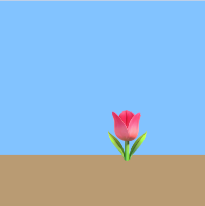

## What you will make

Use the skills you have learned to create your own animation.

The starter project animates a bean growing into a flower. You will change the background, the emojis, the speed, and the timings to make an animation of your own.

